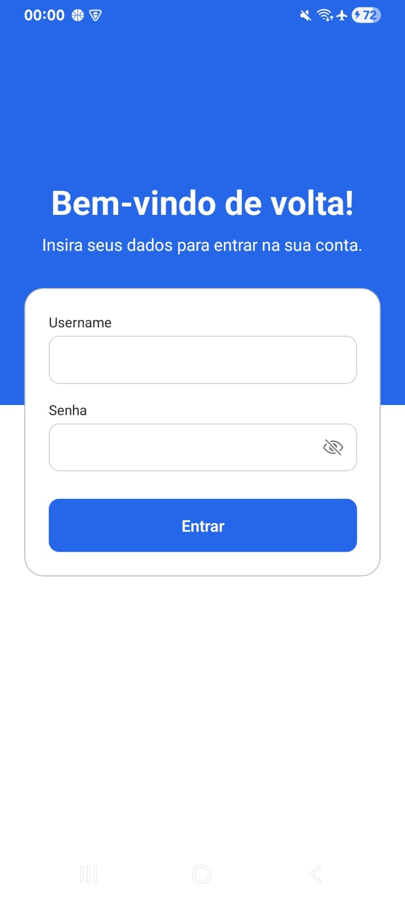
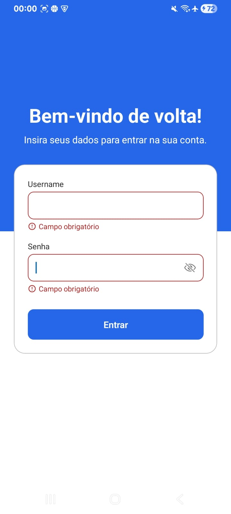
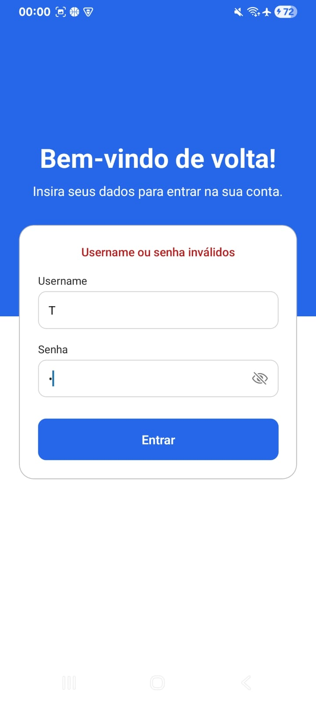
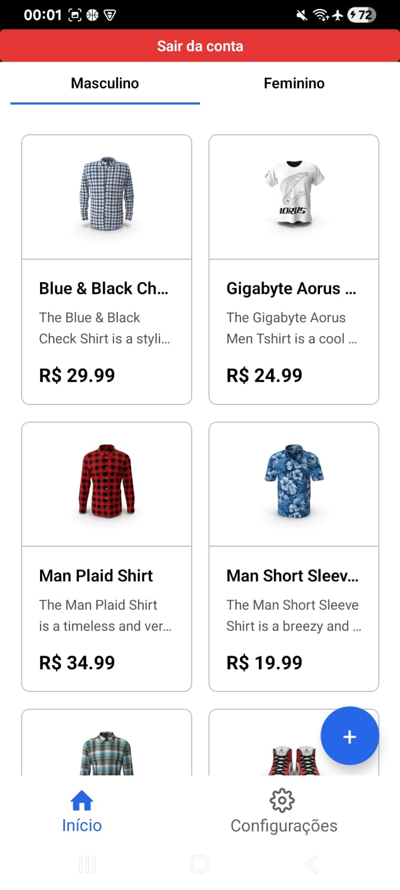
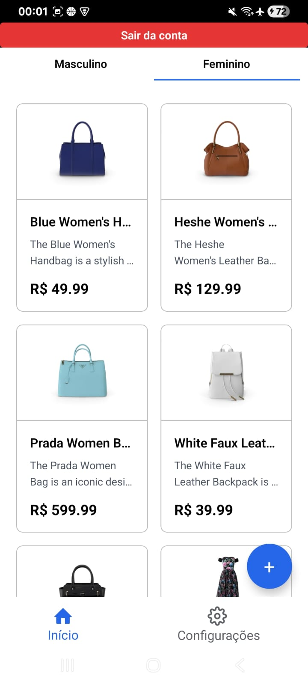
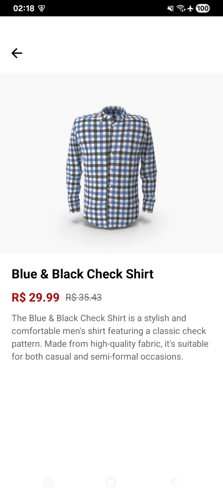

<<<<<<< HEAD
# Catalo-mobile

# 🛍️ Mobile Store App

Aplicativo mobile desenvolvido com **React Native e Expo** que consome uma **API REST** para exibir produtos organizados por categorias.

O projeto foi desenvolvido para a disciplina de **Mobile Development**, com foco em consumo de API, navegação entre telas e gerenciamento de estado.

---

# 📱 Demonstração do Aplicativo

## 🔐 Tela de Login

Permite que o usuário acesse o aplicativo informando **username** e **senha**.
O sistema também possui **validação de campos obrigatórios**.



---

## ⚠️ Validação de Campos

Caso os campos não sejam preenchidos corretamente, o aplicativo mostra uma **mensagem de erro** indicando que os dados são obrigatórios.



---

## 👕 Produtos Masculinos

Após realizar o login, o usuário pode visualizar os **produtos da categoria masculina**.
Os dados são carregados dinamicamente através de uma **API externa**.



---

## 👗 Produtos Femininos

O aplicativo também permite visualizar **produtos femininos**, exibidos em formato de lista com imagem, nome e preço.



---

---
## Informação do Produto
    Ao clicar no carddo produto sera encaminhado atraves do ID as informações completas do produto especifico ao qual o ID pertencce

    

---
# 🚀 Tecnologias Utilizadas

* **React Native**
* **Expo**
* **Expo Router**
* **Axios**
* **Redux Toolkit**
* **JavaScript**

---

# 🔌 Consumo de API

Os produtos são carregados a partir de uma **API REST externa** utilizando a biblioteca **Axios**.
As requisições são feitas de forma assíncrona e os dados são exibidos dinamicamente na interface do aplicativo.

---

# 🧭 Navegação

A navegação entre as telas foi implementada utilizando **Expo Router**, permitindo:

* Tela de **Login** 
* Tela de **Produtos Masculinos**
* Tela de **Produtos Femininos**
* Navegação entre categorias

---

# 🗂 Estrutura do Projeto

A aplicação foi organizada para facilitar manutenção e escalabilidade:

```
src
 ├── components
 │   └── componentes reutilizáveis
 │
 ├── screens
 │   └── telas do aplicativo
 │
 ├── services
 │   └── consumo da API
 │
 ├── store
 │   └── configuração do Redux Toolkit
 │
 └── assets
     └── imagens e recursos visuais
```

---

# ▶️ Como Executar o Projeto

### 1️⃣ Clonar o repositório

```bash
git clone https://github.com/seu-usuario/seu-repositorio.git
```

### 2️⃣ Instalar dependências

```bash
npm install
```

### 3️⃣ Iniciar o projeto

```bash
npx expo start
```

### 4️⃣ Executar o aplicativo

Abra no **Expo Go** ou em um **emulador Android/iOS**.

---

# 👨‍💻 Autor

Projeto desenvolvido para a disciplina de **Mobile Development** com foco em **React Native, consumo de API REST e gerenciamento de estado com Redux Toolkit**.
=======
# Catalogo-Mobile
>>>>>>> 20954e2963b78d2d9254c54b12b87108e123a38e
